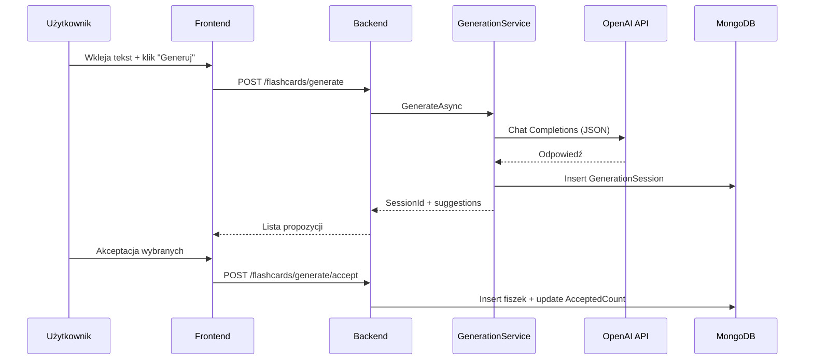
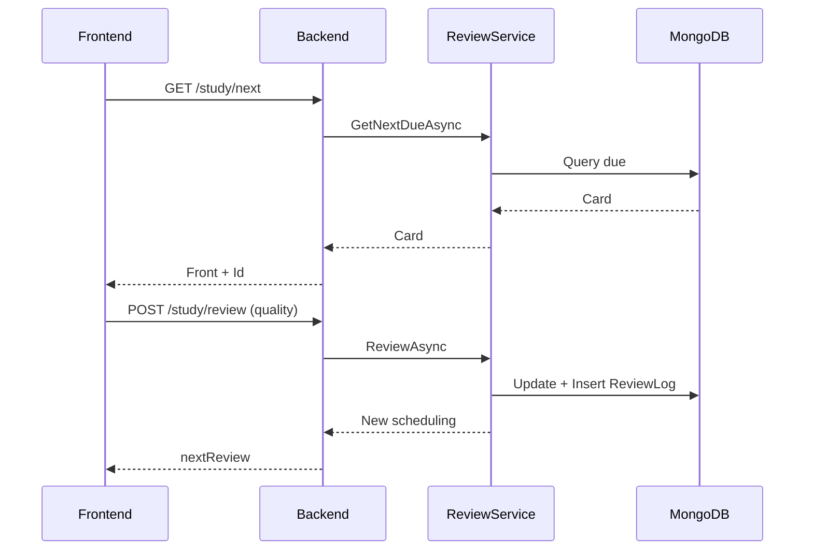

<div align="center">

# 10xCards

AI‑assisted spaced repetition flashcards. Generate, refine, and review knowledge efficiently.

</div>

## Spis treści
- [Opis](#opis)
- [Kluczowe funkcje](#kluczowe-funkcje)
- [Stack technologiczny](#stack-technologiczny)
- [Architektura](#architektura)
- [Algorytm powtórek](#algorytm-powtórek)
- [Szybki start (dev)](#szybki-start-dev)
- [Konfiguracja](#konfiguracja)
- [Endpointy (skrót)](#endpointy-skrot)
- [Testy](#testy)
- [Przykładowy test domenowy](#przykladowy-test-domenowy)
- [Bezpieczeństwo i ograniczenia](#bezpieczenstwo-i-ograniczenia)
- [Możliwe kierunki rozwoju](#mozliwe-kierunki-rozwoju)

## Opis
10xCards to aplikacja do nauki metodą interwałowych powtórek, z możliwością automatycznego generowania fiszek przez modele językowe. Celem jest skrócenie czasu tworzenia materiału i zwiększenie retencji poprzez inteligentne planowanie kolejnych powtórek.

## Kluczowe funkcje
- Rejestracja / logowanie z JWT
- Generowanie fiszek (OpenAI) z akceptacją wybranych
- Ręczne tworzenie i edycja fiszek
- Spaced repetition (zmodyfikowany SM‑2 + natychmiastowe krótkie retry dla niskiej jakości)
- Nauka w kolejce (client‑side learning queue) + ocena jakości 0–5
- Statystyki: generowania (proposed/accepted, AI vs manual) oraz dzienne nauki (accuracy, dystrybucja quality)
- Reset powtórek (pojedyncza, lista, wszystkie)
- Konto: przegląd i usunięcie
- Rate limiting (login, generowanie) in‑memory
- Indeksy Mongo (unikalny email, złożone indeksy flashcards)
- UI: React + Chakra, landing z motywacją i skeleton loaderami

## Stack technologiczny
Backend: .NET 9 Minimal API, MongoDB.Driver, JWT, BCrypt

Frontend: React 18 + Vite + TypeScript + Chakra UI + React Router

AI: OpenAI Chat Completions (JSON output enforced)

Testy: xUnit, FluentAssertions, Mongo2Go (embedded Mongo dla testów), Moq (przyszłe mocki)

## Architektura
```
10xCards.backend
	Program.cs          -> Kompozycja usług + pipeline
	Endpoints/          -> Modularne rozszerzenia (Auth, Flashcards, Study, Stats)
	Services/           -> Logika domenowa (Auth, FlashcardService, GenerationService, ReviewService, StatsService, AccountService)
	Domain/             -> Modele (User, Flashcard, GenerationSession, ReviewLog)
	Infrastructure/     -> MongoContext + indeksy

10xCards.frontend
	src/pages/          -> Widoki (Landing, Login, Register, Generate, MyFlashcards, Study, Stats, Account)
	src/state/          -> Auth (localStorage), API wrapper
	vite.config.ts      -> Proxy do backendu (dev)
```

### Architektura logiczna (opis)
Kluczowe komponenty i zależności bez diagramu graficznego:
1. Frontend (React + Chakra UI)
	- Strony (Landing, Auth, Generate, MyFlashcards, Study, Stats, Account)
	- Lokalny store tokena (localStorage) + lekki wrapper HTTP (Authorization: Bearer)
	- Kolejka nauki po stronie klienta minimalizuje round‑tripy (pobieramy następną kartę tylko gdy potrzeba)
2. Backend (.NET 9 Minimal API)
	- Warstwa endpointów zgrupowana w rozszerzeniach: Auth, Flashcards, Study, Stats
	- Usługi domenowe izolujące logikę (AuthService, FlashcardService, GenerationService, ReviewService, StatsService, AccountService)
	- Middleware: JWT auth, rate limiting (wybrane ścieżki), Swagger (dev), CORS
3. Persistence (MongoDB)
	- Kolekcje: Users, Flashcards, GenerationSessions, ReviewLogs
	- Indeksy: unikalny email; złożone (UserId + NextReview), (UserId + CreatedAt) przyspieszają zapytania due i sortowanie
4. AI (OpenAI API)
	- GenerationService wysyła prompt z wymuszonym JSON (response_format) i waliduje / filtruje odpowiedź
	- Akceptacja wybranych propozycji aktualizuje GenerationSession (AcceptedCount) i tworzy fiszki źródła AI
5. Przepływ autoryzacji
	- Rejestracja -> hash hasła (BCrypt) -> zapis użytkownika
	- Logowanie -> weryfikacja -> wydanie JWT (HS256, 7 dni) -> frontend przechowuje token
6. Przepływ nauki (spaced repetition)
	- GET /study/next: wybór najbliższej due karty użytkownika
	- POST /study/review: aktualizacja pól (IntervalDays, EaseFactor, NextReview, Repetitions) + zapis ReviewLog
	- Niskie oceny (<3) wymuszają krótkie retry (sekundy/minuty) zamiast standardowego interwału
7. Statystyki
	- GenerationStats: agreguje sesje generowania (proposed vs accepted, AI vs manual)
	- StudyDailyStats: analiza dziennych ReviewLogs (accuracy, rozkład quality)
8. Granice / komunikacja
	- Frontend komunikuje się wyłącznie REST JSON
	- Brak wewnętrznego event busa – przepływy synchroniczne i proste
9. Decyzje projektowe (skrót):
	- Minimal API + wydzielone moduły dla czytelności przy małej bazie kodu
	- Mongo zamiast relacyjnej bazy (elastyczne dokumenty dla fiszek + szybkie prototypowanie)
	- Brak refresh tokenów (MVP) – prostota kosztem UX przy wygaśnięciu sesji
	- In-memory rate limiting (wystarczające na dev / single instance)

Ten opis zastępuje wcześniej problematyczny diagram Mermaid (rendering). W razie potrzeby można ponownie dodać wersję graficzną po ustabilizowaniu środowiska renderującego.

	### Model danych (ER – uproszczenie)
	```mermaid
	erDiagram
		USER ||--o{ FLASHCARD : owns
		USER ||--o{ GENERATIONSESSION : creates
		USER ||--o{ REVIEWLOG : produces
		FLASHCARD ||--o{ REVIEWLOG : has

		USER { string Id string Email string PasswordHash }
		FLASHCARD { string Id string UserId string Front string Back date CreatedAt date NextReview int IntervalDays double EaseFactor int Repetitions enum Source }
		GENERATIONSESSION { string Id string UserId int ProposedCount int AcceptedCount }
		REVIEWLOG { string Id string UserId string FlashcardId int Quality date ReviewedAt }
	```

### Przepływ generowania
1. Użytkownik wkleja tekst
2. Backend buduje prompt + wysyła do OpenAI (wymusza JSON)
3. Odbiera, ekstrahuje propozycje -> zapisuje GenerationSession
4. Klient pozwala edytować / zaakceptować wybrane -> backend tworzy fiszki AI + aktualizuje AcceptedCount

#### Diagram sekwencji (generowanie)


### Przepływ nauki
1. Frontend pobiera kolejno karty due (endpoint `/study/next`)
2. Użytkownik ocenia (0–5) -> `/study/review`
3. Algorytm aktualizuje interval, ease factor, następny termin lub krótkie retry
4. Log zapisywany w `ReviewLogs` -> statystyki dzienne

#### Diagram sekwencji (powtórka)


## Algorytm powtórek
Wariant SM‑2 uproszczony:
- quality < 3: reset repetitions = 0, bardzo krótki interwał (sekundy / minuty) – natychmiastowe wzmocnienie
- quality ≥ 3: klasyczna progresja (1d, 6d, potem * EF)
- EF korygowany standardową formułą, dolny limit 1.3

### Diagram decyzji (ocena jakości)
```mermaid
flowchart TD
	Q[Quality 0-5] -->|<3| Low[Low quality]
	Q -->|>=3| High[High quality]
	Low --> Reset[Repetitions=0]
	Reset --> Short[Krótki interwał (sekundy/minuty)] --> NR[NextReview]
	High --> Rep{Repetitions}
	Rep -->|0| I1[Interval=1d]
	Rep -->|1| I2[Interval=6d]
	Rep -->|>1| IM[Interval *= EF]
	I1 --> EFU[Update EF]
	I2 --> EFU
	IM --> EFU --> NR2[NextReview (dni)]
```

## Szybki start (dev)
### Wymagania
- .NET 9 SDK
- Node 18+ / pnpm lub npm
- Lokalne MongoDB lub Docker
- Klucz OpenAI (opcjonalnie – generowanie)

### Uruchomienie backendu
1. Ustaw zmienne lub `appsettings.json` (Mongo, Jwt, OpenAI)
2. `dotnet run` w katalogu `10xCards.backend/10xCards.backend`

### Uruchomienie frontendu
1. `cd 10xCards.frontend`
2. `npm install`
3. `npm run dev`

## Konfiguracja
Cała konfiguracja trzymana jest w `appsettings.json` (i/lub wariantach środowiskowych). Frontend w dev używa proxy Vite, więc nie wymaga pliku `.env`.

Sekcja `Jwt:` wymaga klucza >= 32 bajtów dla HS256.
```
{
	"Mongo": { "ConnectionString": "mongodb://localhost:27017", "Database": "10xcards_dev" },
	"Jwt": { "Key": "CHANGE_ME_MIN_32_BYTES_SECRET_KEY_123456", "Issuer": "10xCards", "Audience": "10xCards" },
	"OpenAI": { "ApiKey": "sk-...", "Model": "gpt-4.1-mini" }
}
```

## Endpointy (skrót)
| Metoda | Ścieżka | Opis | Auth |
|--------|--------|------|------|
| POST | /auth/register | Rejestracja | ❌ |
| POST | /auth/login | Login (rate limit) | ❌ |
| GET | /flashcards | Lista użytkownika | ✅ |
| POST | /flashcards | Dodanie | ✅ |
| PUT | /flashcards/{id} | Aktualizacja | ✅ |
| DELETE | /flashcards/{id} | Usunięcie | ✅ |
| POST | /flashcards/{id}/reset | Reset jednej | ✅ |
| POST | /flashcards/reset | Reset wielu | ✅ |
| POST | /flashcards/reset/all | Reset wszystkich | ✅ |
| POST | /flashcards/generate | Generowanie (rate limit) | ✅ |
| POST | /flashcards/generate/accept | Akceptacja AI | ✅ |
| GET | /study/next | Następna fiszka due | ✅ |
| POST | /study/review | Ocena (0–5) | ✅ |
| GET | /stats/generation | Statystyki generowania | ✅ |
| GET | /stats/study/today | Statystyki dzisiejszej nauki | ✅ |
| GET | /account | Przegląd konta | ✅ |
| DELETE | /account | Usunięcie konta | ✅ |

## Testy
Projekt: `10xCards.backend.Tests`
- Embedded Mongo (Mongo2Go) dla odtwarzalnych scenariuszy
- Skupienie na logice domenowej (Auth, Flashcards, Review, Stats)
- OpenAI wyłączone runtime w konfiguracji Debug testów (ExcludeAssets) by uprościć środowisko

Uruchomienie:
```
dotnet test ./10xCards.backend/10xCards.backend.Tests/10xCards.backend.Tests.csproj -c Debug
```

## Przykładowy test domenowy
Reprezentatywny test pokazujący kluczową regułę biznesową (natychmiastowe krótkie retry przy niskiej jakości):
```csharp
[Fact]
public async Task ReviewAsync_LowQuality_ShortInterval()
{
		var (review, _, userId, card) = SeedOne();
		var before = DateTime.UtcNow;
		var updated = await review.ReviewAsync(userId, card.Id, 1);
		updated.Should().NotBeNull();
		var deltaMinutes = (updated!.NextReview - before)!.Value.TotalMinutes;
		deltaMinutes.Should().BeGreaterThanOrEqualTo(0);
		deltaMinutes.Should().BeLessThan(10); // krótkie okno powtórki
}
```

## Bezpieczeństwo i ograniczenia
- JWT przechowywany w localStorage (łatwe, ale podatne na XSS – produkcyjnie rozważyć httpOnly cookie)
- Brak refresh tokenów (sesja 7 dni) – TODO: rotacja
- Brak twardego limitu rozmiaru generowanych odpowiedzi poza parametrami modelu
- Rate limiting in-memory – poziom pojedynczej instancji; produkcyjnie Redis / distribuowany licznik
- Brak globalnego standardu błędów (obecnie proste stringi) – możliwość ujednolicenia

## Możliwe kierunki rozwoju
- Scheduler w tle do prefetch due metrics
- Tagowanie / decki / import CSV
- Anki export (.apkg) / import
- Wersjonowanie fiszek / historia zmian
- Ulepszone generowanie (chunking źródła, embeddings do deduplikacji)
- Progressive Web App / offline queue
- Segmentacja użytkowników + anonimizowane agregaty

---
